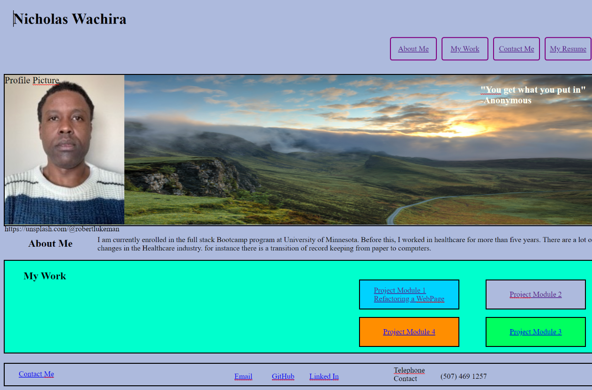

This website was created with html and css. The images are obtained from my personal files.
The navigation bar has four links which when clicked will direct the user by scrolling down 
to the section with the information.
The resume section was linked to another html page which i created to contain information
about me. The page has a separate css external css file linked to it.
The section with the background image was obtained from https://unsplash.com/@robertlukeman.
The section about me contains a paragraph with a brief description about me and my future
interest.
The webpage scrolled down will go to the about me section which is explained above.
The work section contains four boxes. The first two boxes are deployed link in my repository, module 1 
project and the second box is linked to my current deployed link in my repository.
The first box on mouse hover increases in size with a background image of the Horiseon refactoring
challenge.
The second box on mouse over increases in size with a background image of the current assignment.
Third and fourth boxes are just placeholders at the moment.
The footer section contains the contact me links, Email, linkedIn, Phone Number and at the moment they
are just place holders.
The whole webpage is constructed with sections which are contained inside flexboxes and the webpage
responds positively to different screen sizes. In the css for the main webpage i included a media
screen attributes at the end of the css file.

Image of the website.

